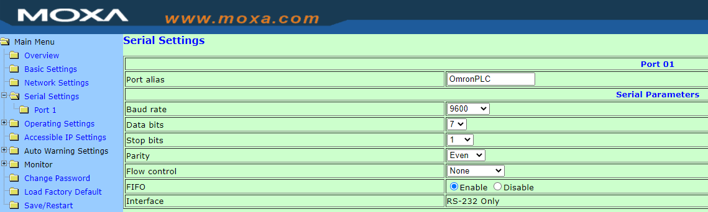
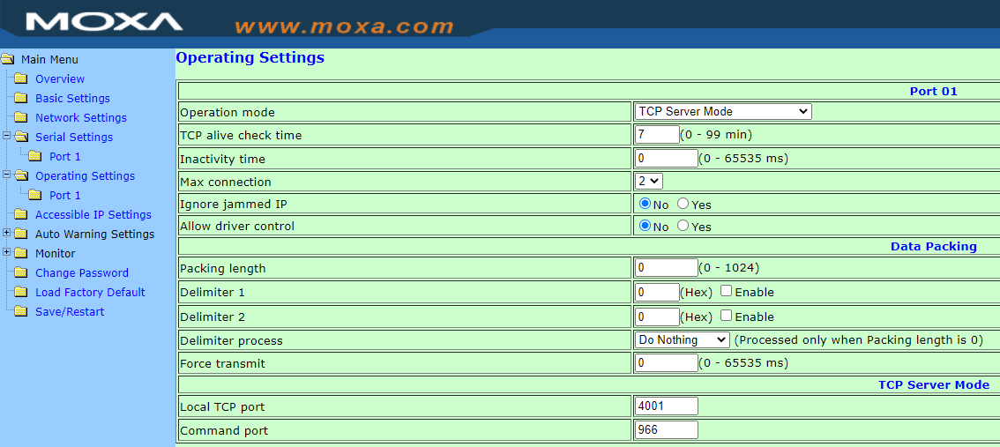

# What?
This program fetches data from Omron PLC and feeds it into Home Assistant via Auto Discovery

## How?

I have an old Omron PLC that is used for home automation. This PLC is +20 years old but still works like a charm!  
The only drawback, it doesn't have an IP interface! As a solution I use a Moxa Nport 5501 Serial-to-IP converter.  
This Moxa device enables me to talk to the PLC over TCP.  

## Setup
```bash

                                                Moxa Nport 5501      -------->   Omron PLC C200H
                                                     |
                                                     |
                                                     |
                            Synology NAS running the Python code in a cronjob <----- CSV file as input.
                                                     |
                                                     |
                                                     |
                                    MQTT Broker (running on Home Assistant)
                                                     |
                                                     |
                                                     |                                                                                                 
                                        Home assistant (VM)                                  

```
The script will send the 'read' commands towards the PLC to read out the bit state data. I uses a CSV file as input.  
This data (=symbols) can be exported if you use CX Programmer for example to edit your PLC program.  
It simply contains the list of all BOOL bits that represent the state of an output.  

## CSV input file

```bash
Location;Input;Input Address;Output;Output Address
Portaal;A_Portaal_Togglebit2;HR5.06;A_Portaal;171.12
Terras;A_Buiten_Achtergevel_Togglebit2;HR5.14;A_Terras_Gevel_Oprit;191.02
Terras;A_Buiten_Achtergevel_Togglebit2;HR5.14;A_Terras_Gevel_Voordeur;191.03
```

## From bit data to MQTT to Home Assistant
191.01 -> represents the address in memory of the PLC. If this bit is 1, the light is ON. If this bit is 0 the light is OFF.  
The code will connect to the PLC. Read & validate the data and send the results to the MQTT broker.  

The payload looks like this:

MQTT topic: homeassistant/switch/a_portaal/config
```json
{
  "name": "a_portaal",
  "payload_on": "@00SC0252*;@00KSHR  00050641*;@00SC0353*",
  "payload_off": "@00SC0252*;@00KRHR  00050640*;@00SC0353*",
  "state_topic": "homeassistant/switch/a_portaal/state",
  "command_topic": "homeassistant/switch/a_portaal/set",
  "state_on": "ON",
  "state_off": "OFF",
  "icon": "mdi:lightbulb",
  "value_template": "{{ value_json.state }}",
  "unique_id": "a_portaal",
  "device": {
    "name": "a_portaal",
    "identifiers": "HR5.06:0"
  }
}
```
MQTT topic: homeassistant/switch/a_portaal/state
```json
{
  "state": "OFF"
}
```
***

## Screenshots in Docu:
The Moxa Serial-2-IP connector  
  
The Moxa Serial-2-IP connector  TCP Server mode settings  
  


